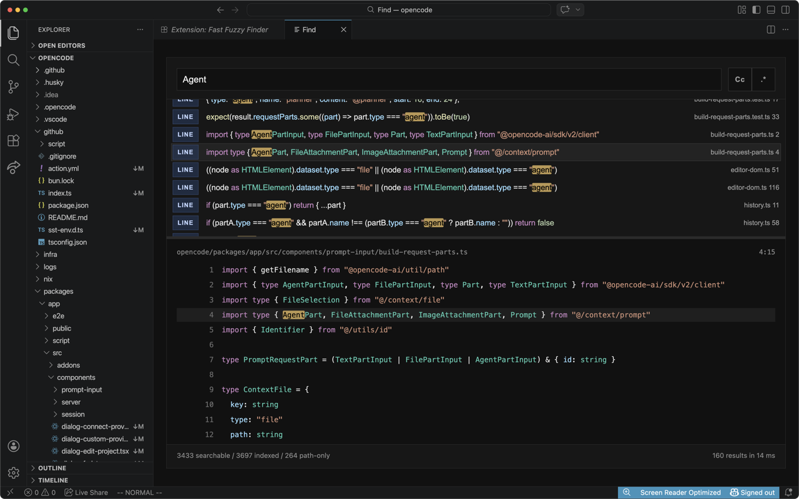

<h1 align="center">
  <br/>
  Fast Fuzzy Finder
</h1>

<p align="center">
  <strong>Sub-10ms fuzzy search popup for VS Code</strong><br/>
  Powered by <a href="https://github.com/dmtrKovalenko/fff.nvim">fff.nvim</a> · Inspired by JetBrains Search Everywhere
</p>

<p align="center">
  <a href="https://marketplace.visualstudio.com/items?itemName=TaeKim.fast-fuzzy-finder">
    
  </a>
  <a href="https://marketplace.visualstudio.com/items?itemName=TaeKim.fast-fuzzy-finder">
    
  </a>
  <a href="https://marketplace.visualstudio.com/items?itemName=TaeKim.fast-fuzzy-finder">
    
  </a>
  <a href="LICENSE">
    
  </a>
</p>

<p align="center">
  Open with <kbd>Cmd+Shift+F</kbd> / <kbd>Ctrl+Shift+F</kbd> — Type — Navigate — Done.
</p>

<p align="center">
  
</p>

<video src="https://github.com/user-attachments/assets/c7dd7275-8417-43d8-b54d-aea11cc22431" controls />

## Installation

Fast Fuzzy Finder on VSCode Marketplace

Through .vsix file 
1. Go to Releases
2. Download .vsix file
3. In VSCode: cmd+shift+p "Extensions: Install from VSIX..."

## What it does

- Sub 10ms fuzzy search powered by [fff.nvim](https://github.com/dmtrKovalenko/fff.nvim)
- Opens a dedicated search panel on `Cmd+Shift+F` / `Ctrl+Shift+F`
- Fuzzy-matches file paths
- Scans indexed text files for line matches
- Shows a bottom preview pane with surrounding context
- Opens the selected result on `Enter` or double-click

## Current limitations

- VS Code does not expose a true centered modal extension API, so this is implemented as a modal-styled webview panel in the editor area.
- Content search is done against an in-memory index of text files up to a size budget, so very large or binary files fall back to path-only matches.

## Development

```bash
npm install
npm run compile
```

`npm run compile` now builds both the TypeScript extension and the bundled Rust `fff` sidecar for the current platform. For iterative frontend work, `npm run watch` still only recompiles the TypeScript sources; if you change the Rust bridge, rerun `npm run build:native`.
